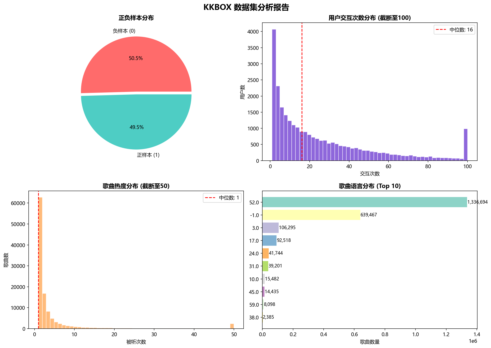

# KKBOX 数据集分析报告

生成时间: 2026-01-22 19:13:23

## 1. 数据规模

| 指标 | 数值 |
|------|------|
| 总交互记录 | 7,377,418 |
| 唯一用户数 | 30,755 |
| 唯一歌曲数 | 359,966 |
| 歌曲库总量 | 2,296,320 |

## 2. 样本分布

- 正样本比例: 50.5%
- 负样本比例: 49.5%

## 3. 数据质量问题

- ✅ 未发现重大问题

## 4. 可视化

