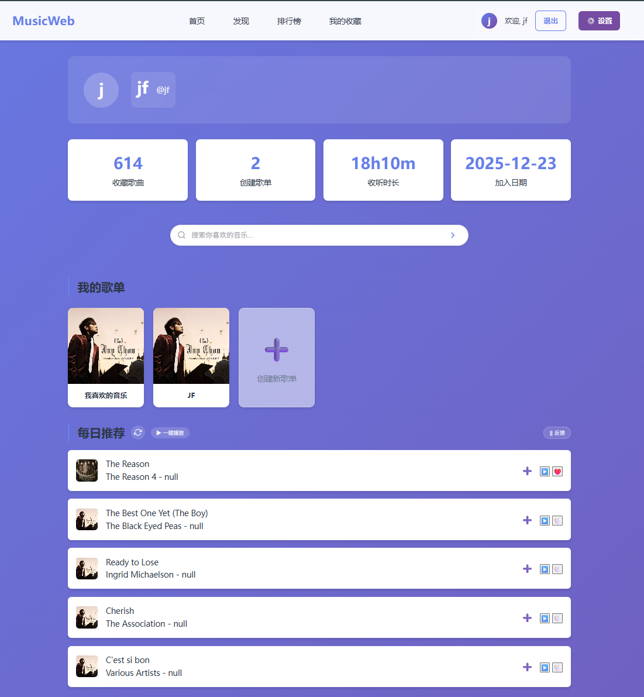
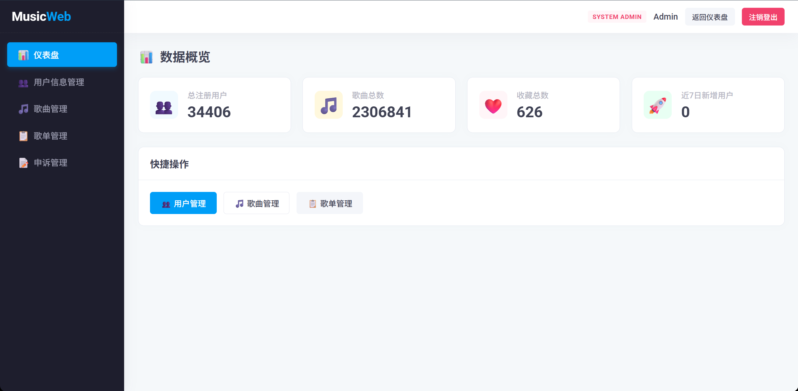
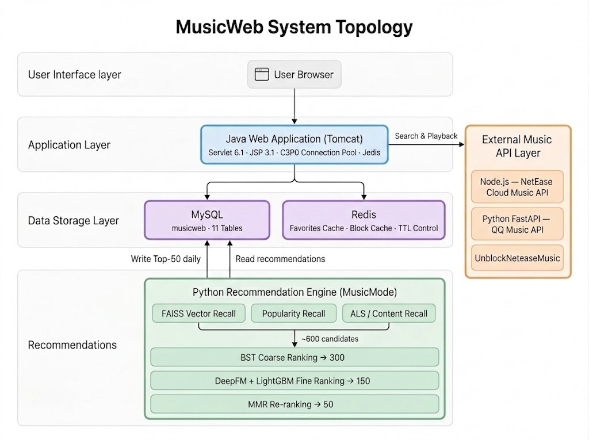
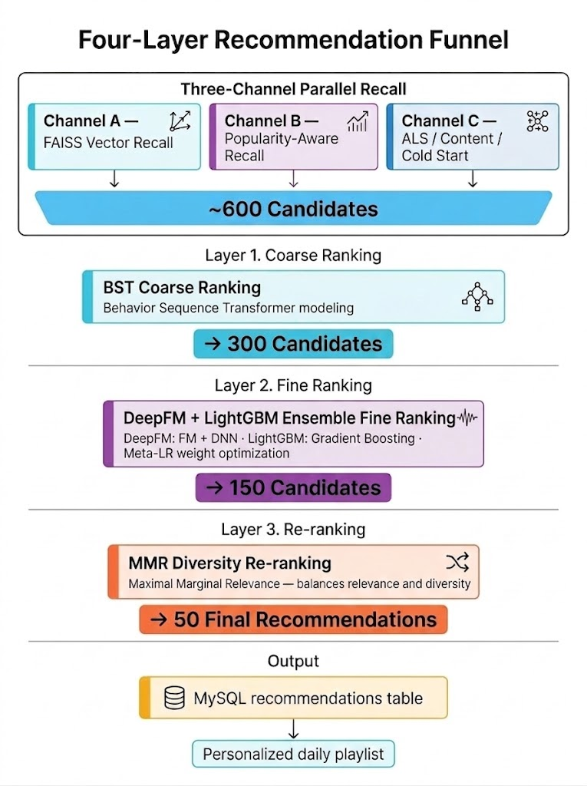

<div align="center">

# 🎵 MusicWeb

**基于大数据技术的个性化在线音乐推荐平台**

*A full-stack music platform powered by a multi-model recommendation engine*

<p align="center">
  <a href="https://openjdk.org/"></a>
  <a href="https://python.org/"></a>
  <a href="https://mysql.com/"></a>
  <a href="https://redis.io/"></a>
  <a href="https://pytorch.org/"></a>
  <a href="LICENSE"></a>
</p>

</div>

---

## 项目简介 (About)

MusicWeb 是一个**双模块全栈音乐平台**，由 Java Web 前端服务与 Python 推荐算法引擎（MusicMode）共同构成。用户在平台上的每一次播放、收藏、跳过，都会被实时记录并反馈给后端推荐模型，形成持续自我优化的"数据闭环"。

**核心亮点：**

- **四层漏斗推荐**：三通道并行召回（~600首）→ LightGBM 粗排（→300）→ DeepFM + BST 集成精排（→150）→ MMR 多样性重排（→50），每日为用户生成专属推荐
- **三层用户分层路由**：新用户冷启动、有行为用户实时内容召回、老用户协同过滤，不同阶段用不同策略
- **多模型集成**：LightGBM + DeepFM + BST，OOF Stacking + Meta-LR 融合，集成 AUC **0.8304**
- **多源音乐接入**：同时接入网易云音乐和 QQ 音乐，播放外部歌曲时自动入库并补全元数据

> **数据规模**：KKBOX 数据集 229 万首歌曲，7.37M 训练样本，28,172 名用户离线评估，HR@5 = **0.9877**，NDCG@5 = **0.8392**

---

## 效果展示 (Screenshots)

### 首页


### 用户端界面



### 管理员后台



---

## 系统架构 (Architecture)

### 服务拓扑



### 推荐四层漏斗



---

## 功能特性 (Features)

| 模块                   | 功能描述                                                                             |
| ---------------------- | ------------------------------------------------------------------------------------ |
| 🎵**个性化推荐** | ML 驱动，每日推送 50 首专属歌曲；三层用户分层路由，适配新老用户不同阶段              |
| 🔍**多源搜索**   | 同时接入网易云音乐 + QQ 音乐，自动识别 VIP 歌曲，记录最近 5 条搜索历史               |
| 📂**歌单管理**   | 创建/编辑/删除自定义歌单，5 种排序方式（时间/歌手/专辑/年份/播放次数），分页浏览     |
| ❤️**智能收藏** | Redis 缓存加速收藏状态查询，一键加入"我喜欢的音乐"默认歌单                           |
| 🚫**内容屏蔽**   | 主动屏蔽流派或艺术家，推荐自动过滤；屏蔽次数越多有效期越长（首次 14 天，每次 +7 天） |
| 🎛️**管理后台** | 用户冻结/解冻、歌曲增删改查、申诉审批，4 项 KPI 数据仪表盘                           |
| 📬**账号申诉**   | 账号冻结/注销后可提交申诉，管理员审批后自动发送 163 邮件通知并恢复账号               |
| 📊**排行榜**     | 热歌榜（全局播放量）· 新歌榜（发行时间）· 收藏榜（被收藏次数），各展示 10 首       |
| 🎧**在线播放器** | 底部固定悬浮播放器，支持上/下一曲、进度拖拽、音量控制、循环/随机模式切换             |
| 📅**播放历史**   | 自动记录全部播放行为，支持最近一周/一月/三月时间范围过滤，分页浏览                   |

---

## 技术栈 (Tech Stack)

### Java Web 层

| 类别     | 技术                                       |
| -------- | ------------------------------------------ |
| 语言     | Java 23                                    |
| Web 框架 | Jakarta Servlet 6.1 · JSP 3.1 · JSTL 3.0 |
| 数据库   | MySQL 8.4                                  |
| 缓存     | Redis 5.0+ · Jedis 5.1.0                  |
| 连接池   | C3P0 0.9.5.5                               |
| 构建工具 | Maven 3.x                                  |

### 外部音乐 API 中间层

| 服务           | 技术                           | 端口 |
| -------------- | ------------------------------ | ---- |
| 网易云音乐 API | Node.js (NeteaseCloudMusicApi) | 3000 |
| QQ 音乐 API    | Python FastAPI                 | 8000 |
| 解灰服务       | UnblockNeteaseMusic            | 8081 |

### Python 推荐引擎（MusicMode）

| 类别       | 技术                                                  |
| ---------- | ----------------------------------------------------- |
| 语言       | Python 3.12                                           |
| 数据处理   | Pandas 2.2+ · NumPy 1.24+ · PySpark 4.0             |
| 机器学习   | LightGBM · PyTorch 2.x (GPU AMP)                     |
| 深度学习   | DeepFM v3 (embedding_dim=32) · BST (Transformer+MLP) |
| 向量检索   | FAISS（5×32维 = 160维嵌入）                          |
| 协同过滤   | Spark MLlib ALS (rank=50, iter=10)                    |
| 特征工程   | OOF Target Encoding · SVD 嵌入 · 滚动窗口特征       |
| 数据库驱动 | PyMySQL 1.1+ · SQLAlchemy 2.0+                       |

---

## 快速开始 (Getting Started)

### 环境要求

| 依赖    | 版本 | 备注                    |
| ------- | ---- | ----------------------- |
| JDK     | 23+  | Java Web 运行环境       |
| Maven   | 3.x  | 项目构建                |
| MySQL   | 8.4  | 主数据库                |
| Redis   | 5.0+ | 缓存数据库              |
| Tomcat  | 10.x | Web 服务器              |
| Node.js | 18+  | 网易云 API 服务         |
| Python  | 3.12 | 推荐引擎 · QQ 音乐 API |

### 第一步：数据库初始化

```bash
mysql -u root -p < Project/MusicWeb/sql/database.sql
```

### 第二步：创建隐私配置文件（必须）

复制模板文件并重命名：

```bash
cp secrets.txt.example secrets.txt
```

然后编辑 `secrets.txt`，填写以下配置：

| 配置项                                                | 说明                                       |
| ----------------------------------------------------- | ------------------------------------------ |
| `DB_USER` / `DB_PASSWORD`                         | MySQL 数据库用户名和密码                   |
| `MAIL_USERNAME` / `MAIL_PASSWORD` / `MAIL_FROM` | 163 邮箱账号及授权码（申诉邮件通知用）     |
| `LASTFM_API_KEY` / `LASTFM_SHARED_SECRET`         | Last.fm API 凭证（歌曲元数据补全用，可选） |

### 第三步：配置 Cookie（用于播放网易云/QQ 音乐 VIP 歌曲）

复制模板文件：

```bash
cp Project/MusicWeb/src/main/webapp/MusicServer/Cookie/api_credentials.json.example \
   Project/MusicWeb/src/main/webapp/MusicServer/Cookie/api_credentials.json
```

然后编辑 `api_credentials.json`，填写以下字段：

| 字段               | 获取方式                                                                              |
| ------------------ | ------------------------------------------------------------------------------------- |
| `netease_cookie` | 登录网易云音乐网页版，从浏览器开发者工具 → Network → Cookie 中提取 `MUSIC_U` 字段 |
| `qq_cookie`      | 登录 QQ 音乐网页版，提取完整 Cookie 串（含 `qqmusic_key` 等字段）                   |

> 不配置此文件时，普通免费歌曲仍可正常播放，VIP 解灰功能不可用。

### 第五步：一键启动所有服务（推荐）

```bash
Project/MusicWeb/scripts/run_services.bat
```

脚本按序启动 5 项服务，每项均通过端口就绪检测后才启动下一项，任一超时则自动中止：

| 顺序 | 服务                | 端口 | 超时       |
| ---- | ------------------- | ---- | ---------- |
| 1    | Redis               | 6379 | 15s        |
| 2    | Python QQ 音乐 API  | 8000 | 30s        |
| 3    | UnblockNeteaseMusic | 8081 | 15s        |
| 4    | Node.js 网易云 API  | 3000 | 20s        |
| 5    | Java Web / Tomcat   | 8082 | Maven 控制 |

停止所有服务：`Project/MusicWeb/scripts/stop_services.bat`

### 第六步：访问

| 页面 | 地址                                                            |
| ---- | --------------------------------------------------------------- |
| 首页 | [http://localhost:8082/musicweb/](http://localhost:8082/musicweb/) |

---

## 核心功能 (Core Features)

### 1. 个性化推荐系统

- **每日 Top-50 推荐**：推荐结果预计算写入 `recommendations` 表，用户访问时毫秒级读取展示
- **分页刷新**：支持 offset 参数分页加载更多推荐（每次 5 首），`RefreshRecommendServlet` 处理
- **冷启动推荐**：新用户注册时根据所选流派和歌手偏好生成初始 20 首推荐（`RecommendationService.initForNewUser`）
- **推荐反馈冷却**：`recommendation_feedback` 表追踪每首推荐的播放/收藏/忽略行为，`negative_count` 触发三档渐进冷却（3/7/14 天），同一首歌不会反复出现

### 2. 多源音乐搜索与自动入库

- **三种来源切换**：网易云音乐 / QQ 音乐 / 全部，`SearchServlet` 调用对应 API
- **VIP 自动识别**：网易云 fee=1/4 或 QQ pay.pay_play=1 的歌曲自动标注 VIP 标签
- **外部歌曲自动入库**：播放网易云/QQ 歌曲时，`UniversalPlayHistoryServlet` 自动写入 `songs` 表并下载封面图
- **元数据自动补全**：缺失 `release_year` / `genre` / `language` 时，自动从 Node.js 或 Python QQ API 多源补全

### 3. 歌单与收藏

- **默认收藏夹**：`is_default=1` 的歌单承接"我喜欢的音乐"功能，❤️ 操作直接写入该歌单
- **收藏状态缓存**：Redis 缓存收藏状态（TTL=1小时），避免每次播放都查库
- **歌单排序**：按添加时间 / 歌手 / 专辑 / 年份 / 播放次数共 5 种维度 + 升降序切换
- **分页浏览**：歌单内歌曲每页 25 首，`PlaylistSongsPageServlet` 处理分页

### 4. 用户偏好与内容屏蔽

- **满意度反馈**：每日可提交不满意/中立/满意/非常满意，动态更新 `preferred_genres` / `preferred_artists`
  - 不满意 → 清空旧偏好，替换为新选内容
  - 满意/中立 → 与现有偏好合并去重追加
- **内容屏蔽**：主动屏蔽流派或艺术家，推荐时自动过滤；屏蔽次数累计驱动有效期递增（首次 14 天，每次 +7 天）；Redis 缓存屏蔽状态（TTL=1小时）

### 5. 管理员后台

- **数据仪表盘**：总用户数 / 总歌曲数 / 总收藏数 / 近 7 日新增用户四项 KPI
- **用户管理**：全量用户信息查看、搜索、排序；账号冻结/解冻操作
- **歌曲管理**：增删改查歌曲，支持按名称/艺术家/专辑搜索，分页浏览
- **申诉审批**：同意/拒绝申诉，填写回复内容；同意后自动恢复账号状态并发送 163 邮件通知

---

## 推荐算法引擎 (Recommendation Engine)

### 三层用户分层路由

```
                        新的推荐请求
                             │
              ┌──────────────▼──────────────┐
              │  用户是否在 ALS 训练集中？    │
              │  且训练期播放次数 ≥ 10 首？   │
              └──────┬────────────┬─────────┘
                   是│            │否
                     ▼            ▼
             ┌──────────┐  ┌──────────────────────────┐
             │  Tier 3  │  │ 歌单合计 ≥ 5 首           │
             │ ALS 协同  │  │OR 质量播放(完成≥30%) ≥10  │
             │ 过滤召回  │  └──────┬────────────┬──────┘
             └──────────┘       是│            │否
                                  ▼            ▼
                          ┌──────────┐  ┌──────────┐
                          │  Tier 2  │  │  Tier 1  │
                          │ 多维度实  │  │ 注册偏好  │
                          │ 时内容召回│  │ 冷启动    │
                          └──────────┘  └──────────┘
```

| 层级   | 适用用户                 | 通道 C 召回策略                           | 特征来源                    |
| ------ | ------------------------ | ----------------------------------------- | --------------------------- |
| Tier 3 | 训练集老用户（播放≥10） | ALS 协同过滤                              | `user_stats.pkl` 历史分布 |
| Tier 2 | 有行为但未入训练集       | 实时多维度内容召回（歌单60%+质量播放40%） | `realtime_dists` 实时分布 |
| Tier 1 | 新用户冷启动             | 注册偏好（流派/艺术家）驱动               | 注册时填写的偏好标签        |

**Tier 2 实时特征自适应**：

- 从 `realtime_dists["genre"]` 实时计算 Shannon 熵，替代 pkl 默认 `user_genre_diversity`
- 从当次 `user_history` 统计播放高峰时段，替代 pkl 默认 `user_peak_hour`
- BST 序列缺失时（< 5 首），自动从 live DB 拉取最近播放历史实时构建行为序列

### 三通道并行召回

| 通道   | 机制                                                           | 候选数 |
| ------ | -------------------------------------------------------------- | ------ |
| 通道 A | FAISS 向量相似召回（用户画像向量 × 歌曲嵌入向量）             | ~200   |
| 通道 B | 满意度感知热度召回（song_rolling_stats 滚动统计 + 满意度权重） | ~200   |
| 通道 C | ALS 协同过滤 / 实时内容召回 / 注册偏好（按用户层级切换）       | ~200   |

### 模型架构

**DeepFM**：稀疏特征 Embedding + FM 二阶交叉 + DNN 高阶交叉并联，embedding_dim=32，GPU AMP 加速

**BST（Behavior Sequence Transformer）**：用户历史行为序列 → Transformer 编码 → 与候选歌曲特征融合 → MLP 四层输出

**集成策略**：DeepFM 与 BST 在 5 折 OOF 框架下分别生成元特征，由 Meta-LR（LogisticRegression 元学习器）拟合融合权重，避免训练集标签泄漏

### 模型性能 (Performance)

#### 模型 AUC 对比

| 模型                    | Train AUC | Val AUC          |
| ----------------------- | --------- | ---------------- |
| LightGBM                | 0.8480    | 0.8226           |
| DeepFM                  | 0.8227    | 0.8202           |
| BST                     | —        | 0.7886           |
| **Meta-LR 集成** | —        | **0.8304** |

#### 离线评估（KKBox 验证集，28,172 用户，726,047 样本，消融实验 A4 全链路配置）

| 指标                        | @K=5               |
| --------------------------- | :----------------: |
| **HR（命中率）**      | **0.9877**   |
| **Precision（精确率）** | **0.7273**   |
| **NDCG**              | **0.8392**   |
| **MRR**               | **0.9010**   |
| **Shannon 熵（多样性）** | **1.2230** |

### 推荐流水线执行指南 (Pipeline)

> 首次部署或数据更新后，按以下顺序执行。日常运营仅需定时运行 Step 9。

```bash
# Step 1：数据清洗与负采样
python -X utf8 Project/MusicMode/Project/data_cleaning.py

# Step 2：特征工程，生成 66 维（14稀疏+52稠密）7.37M 样本
python -X utf8 Project/MusicMode/Project/prepare_features_v3.py

# Step 3：LightGBM 精排训练
python -X utf8 Project/MusicMode/Project/train_lgbm.py

# Step 4：DeepFM 精排训练
python -X utf8 Project/MusicMode/Project/train_deepfm_v3.py

# Step 5：BST 序列粗排训练
python -X utf8 Project/MusicMode/Project/train_bst.py

# Step 6：Meta-LR OOF Stacking 集成训练
python -X utf8 Project/MusicMode/Project/build_ensemble.py

# Step 7：FAISS 160 维向量索引构建
python -X utf8 Project/MusicMode/Project/build_faiss_index.py

# Step 8：ALS 协同过滤召回训练
python -X utf8 Project/MusicMode/Project/train_als.py

# Step 9：推荐生成与写库（每日定时执行）
python -X utf8 Project/MusicMode/Project/sync_recs_v3.py

# ── 辅助脚本 ──
# 刷新歌曲滚动统计（热度召回数据源，建议每日执行）
python -X utf8 Project/MusicMode/Project/refresh_song_stats.py

# 离线评估（KKBox 验证集评估指标）
python -X utf8 Project/MusicMode/Project/evaluate_offline.py

# 真实用户推荐记录评估（CTR/完播率）
python -X utf8 Project/MusicMode/Project/evaluate_recs.py
```

**Python 依赖安装：**

```bash
pip install -r Project/MusicMode/scripts/requirements.txt
```

**PySpark 环境变量（Windows）：**

```powershell
$env:JAVA_HOME   = "C:\Program Files\Eclipse Adoptium\jdk-21.0.9.10-hotspot"
$env:HADOOP_HOME = "<项目根目录>\hadoop\bin"
```

---

## 数据库设计 (Database Schema)

**数据库名：`musicweb`，共 11 张核心业务表**

### 1. `users` — 用户账号

| 字段                  | 类型         | 说明                                  |
| --------------------- | ------------ | ------------------------------------- |
| `id`                | INT          | 主键，自增                            |
| `username`          | VARCHAR(50)  | 用户名，唯一                          |
| `password`          | VARCHAR(100) | 密码                                  |
| `email`             | VARCHAR(100) | 邮箱                                  |
| `nickname`          | VARCHAR(50)  | 昵称                                  |
| `phone`             | VARCHAR(20)  | 手机号                                |
| `status`            | ENUM         | 账号状态（active / frozen / deleted） |
| `frozen_until`      | TIMESTAMP    | 冻结截止时间                          |
| `frozen_reason`     | VARCHAR(200) | 冻结原因                              |
| `deleted_at`        | TIMESTAMP    | 逻辑删除时间                          |
| `create_time`       | TIMESTAMP    | 注册时间                              |
| `preferred_genres`  | VARCHAR(200) | 偏好流派标签（分号分隔）              |
| `preferred_artists` | VARCHAR(200) | 偏好歌手标签（分号分隔）              |
| `city`              | VARCHAR(50)  | 所在城市（推荐特征）                  |
| `gender`            | VARCHAR(10)  | 性别（推荐特征）                      |
| `bd`                | TINYINT      | 年龄（推荐特征）                      |

### 2. `songs` — 歌曲库

| 字段               | 类型         | 说明                                  |
| ------------------ | ------------ | ------------------------------------- |
| `id`             | INT          | 主键，自增                            |
| `title`          | VARCHAR(500) | 歌名                                  |
| `artist`         | VARCHAR(500) | 歌手                                  |
| `album`          | VARCHAR(500) | 专辑                                  |
| `duration`       | INT          | 时长（秒）                            |
| `genre`          | VARCHAR(200) | 流派                                  |
| `release_year`   | INT          | 发行年份                              |
| `file_path`      | VARCHAR(200) | 本地音频文件路径                      |
| `cover_image`    | VARCHAR(200) | 封面图片路径                          |
| `kkbox_id`       | VARCHAR(50)  | KKBOX 原曲 ID（与推荐模型对齐）       |
| `genre_ids`      | VARCHAR(100) | KKBOX 曲风 ID 列表                    |
| `language`       | VARCHAR(10)  | 语言标签（经 ISRC 交叉验证修正）      |
| `popularity`     | INT          | 歌曲热度（归一化至 0~100）            |
| `origin_country` | CHAR(2)      | 原产国家码（ISRC 推断，用于推荐特征） |

### 3. `play_history` — 播放行为

推荐模型的**核心训练数据来源**，记录用户全量播放行为。

| 字段               | 类型        | 说明                                         |
| ------------------ | ----------- | -------------------------------------------- |
| `id`             | INT         | 主键，自增                                   |
| `user_id`        | INT         | 用户 ID                                      |
| `song_id`        | INT         | 歌曲 ID                                      |
| `play_time`      | TIMESTAMP   | 播放时间                                     |
| `play_duration`  | INT         | 实际播放时长（秒）                           |
| `source_type`    | VARCHAR(30) | 来源类型（kkbox / netease / local 等）       |
| `target`         | TINYINT     | 推荐模型标签（1=完整收听，0=跳过）           |
| `source_channel` | VARCHAR(30) | 播放触发渠道（PERSONAL_PLAYLIST / RADIO 等） |

### 4. `user_playlists` — 用户歌单

| 字段            | 类型         | 说明                                   |
| --------------- | ------------ | -------------------------------------- |
| `id`          | INT          | 主键，自增                             |
| `user_id`     | INT          | 创建者 ID                              |
| `name`        | VARCHAR(100) | 歌单名称                               |
| `description` | TEXT         | 歌单描述                               |
| `cover_image` | VARCHAR(200) | 歌单封面路径                           |
| `is_default`  | TINYINT      | 是否为默认收藏歌单（1="我喜欢的音乐"） |
| `create_time` | TIMESTAMP    | 创建时间                               |
| `update_time` | TIMESTAMP    | 最后更新时间（自动更新）               |

### 5. `playlist_songs` — 歌单歌曲关联

多对多关系表，`(playlist_id, song_id)` 唯一约束防止重复添加。

| 字段            | 类型      | 说明        |
| --------------- | --------- | ----------- |
| `id`          | INT       | 主键，自增  |
| `playlist_id` | INT       | 关联歌单 ID |
| `song_id`     | INT       | 关联歌曲 ID |
| `add_time`    | TIMESTAMP | 添加时间    |

### 6. `recommendations` — 推荐结果

Python 引擎计算后写入，前端实时读取展示。

| 字段            | 类型        | 说明                        |
| --------------- | ----------- | --------------------------- |
| `id`          | INT         | 主键，自增                  |
| `user_id`     | INT         | 目标用户 ID                 |
| `song_id`     | INT         | 推荐歌曲 ID                 |
| `score`       | DOUBLE      | 推荐得分                    |
| `create_time` | DATETIME    | 推荐生成时间                |
| `source_type` | VARCHAR(20) | 推荐来源标识（默认 deepfm） |

### 7. `recommendation_feedback` — 推荐反馈

驱动推荐冷却与反馈评分机制的核心行为追踪表。

| 字段                        | 类型      | 说明                                          |
| --------------------------- | --------- | --------------------------------------------- |
| `id`                      | INT       | 主键，自增                                    |
| `user_id`                 | INT       | 目标用户 ID                                   |
| `song_id`                 | INT       | 推荐歌曲 ID                                   |
| `recommend_date`          | DATE      | 推荐日期                                      |
| `was_played`              | TINYINT   | 是否已播放（0/1）                             |
| `play_completion`         | FLOAT     | 播放完成比例                                  |
| `was_favorited`           | TINYINT   | 是否收藏（0/1）                               |
| `consecutive_ignore_days` | INT       | 连续被忽略天数                                |
| `feedback_score`          | FLOAT     | 综合反馈得分（14 天衰减）                     |
| `negative_count`          | INT       | 负反馈累计次数（触发三档渐进冷却：3/7/14 天） |
| `cooldown_until`          | DATE      | 推荐冷却期截止日期                            |
| `created_at`              | TIMESTAMP | 记录创建时间                                  |
| `updated_at`              | TIMESTAMP | 最后更新时间（自动更新）                      |

### 8. `user_preference_feedback` — 口味偏好反馈

归档用户每日对推荐结果的满意度评价，同一用户同一天多次提交则覆盖。

| 字段              | 类型         | 说明                                                          |
| ----------------- | ------------ | ------------------------------------------------------------- |
| `id`            | INT          | 主键，自增                                                    |
| `user_id`       | INT          | 用户 ID                                                       |
| `feedback_date` | DATE         | 反馈日期（与 user_id 构成唯一约束）                           |
| `satisfaction`  | ENUM         | 满意度（very_satisfied / satisfied / neutral / dissatisfied） |
| `genres_added`  | VARCHAR(200) | 本次新增流派偏好（分号分隔）                                  |
| `artists_added` | VARCHAR(200) | 本次新增艺术家偏好（分号分隔）                                |
| `created_at`    | TIMESTAMP    | 记录时间                                                      |

### 9. `user_content_blocks` — 内容屏蔽

| 字段              | 类型         | 说明                              |
| ----------------- | ------------ | --------------------------------- |
| `id`            | INT          | 主键，自增                        |
| `user_id`       | INT          | 用户 ID                           |
| `block_type`    | ENUM         | 屏蔽类型（genre / artist）        |
| `block_value`   | VARCHAR(100) | 屏蔽的具体值（如"电子"/"周杰伦"） |
| `block_count`   | INT          | 屏蔽触发次数（驱动有效期递增）    |
| `blocked_at`    | TIMESTAMP    | 屏蔽创建时间                      |
| `blocked_until` | DATE         | 屏蔽有效期截止日期                |
| `is_active`     | TINYINT      | 屏蔽是否当前生效（0/1）           |

### 10. `appeals` — 账号申诉

| 字段              | 类型         | 说明                                      |
| ----------------- | ------------ | ----------------------------------------- |
| `id`            | INT          | 主键，自增                                |
| `username`      | VARCHAR(50)  | 申诉账号                                  |
| `user_id`       | INT          | 关联用户 ID                               |
| `appeal_type`   | ENUM         | 申诉类型（frozen / deleted）              |
| `reason`        | TEXT         | 申诉理由                                  |
| `contact_email` | VARCHAR(100) | 联系邮箱                                  |
| `status`        | ENUM         | 审批状态（pending / approved / rejected） |
| `admin_reply`   | TEXT         | 管理员回复内容（邮件正文）                |
| `create_time`   | TIMESTAMP    | 申诉创建时间                              |
| `update_time`   | TIMESTAMP    | 最后更新时间（自动更新）                  |

### 11. `song_rolling_stats` — 歌曲滚动统计 ★

**热度召回通道（通道 B）的实时数据源**，由 `refresh_song_stats.py` 定期更新。

| 字段            | 类型      | 说明                                    |
| --------------- | --------- | --------------------------------------- |
| `song_id`     | INT       | 主键，关联 songs.id                     |
| `cnt_7d`      | INT       | 近 7 天播放次数                         |
| `cnt_30d`     | INT       | 近 30 天播放次数                        |
| `trending`    | FLOAT     | 趋势系数（7d/30d 播放比，反映短期飙升） |
| `total_plays` | INT       | 历史累计播放次数                        |
| `updated_at`  | TIMESTAMP | 最后更新时间                            |

---

## 项目结构 (Project Structure)

```
Graduation-project-design/
├── README.md                              # 本文档
├── CHANGELOG.md                           # 项目更新日志
├── LICENSE                                # MIT 许可证
├── secrets.txt.example                    # 隐私配置模板
├── Project/
│   ├── MusicWeb/                          # Java Web 前端服务
│   │   ├── pom.xml                        # Maven 项目配置
│   │   ├── Document/                      # 项目文档
│   │   │   ├── CHANGELOG.md               # MusicWeb 更新日志
│   │   ├── sql/
│   │   │   └── database.sql               # 数据库初始化脚本
│   │   ├── scripts/                       # 自动化运维脚本
│   │   │   ├── run_services.bat           # 一键启动所有服务
│   │   │   ├── stop_services.bat          # 一键停止所有服务
│   │   │   ├── start_qq_api.bat           # Python QQ 音乐服务启动
│   │   │   ├── start_redis.bat            # Redis 服务启动
│   │   │   ├── start.bat                  # Node.js 网易云服务启动
│   │   │   ├── start_unblock.bat          # UnblockNeteaseMusic 启动
│   │   │   └── run_sql.py                 # SQL 批量执行工具
│   │   └── src/main/
│   │       ├── java/com/music/
│   │       │   ├── listener/              # 生命周期监听器
│   │       │   │   └── SecretsLoader.java   # 启动时将 secrets.txt 注入 System.properties
│   │       │   ├── javabean/              # 实体类
│   │       │   │   ├── Appeal.java        # 申诉实体
│   │       │   │   ├── DBUtil.java        # 数据库连接池工具
│   │       │   │   ├── Favorite.java      # 收藏实体
│   │       │   │   ├── PlayHistory.java   # 播放历史实体
│   │       │   │   ├── Playlist.java      # 歌单实体
│   │       │   │   ├── Song.java          # 歌曲实体
│   │       │   │   └── User.java          # 用户实体
│   │       │   ├── dao/                   # 数据访问层
│   │       │   │   ├── AdminDAO.java      # 管理员数据操作
│   │       │   │   ├── AppealDAO.java     # 申诉数据操作
│   │       │   │   ├── PlayHistoryDAO.java # 播放历史数据操作
│   │       │   │   ├── PlaylistDAO.java   # 歌单与收藏数据操作
│   │       │   │   ├── RedisUtil.java     # Redis 缓存工具
│   │       │   │   ├── SongDAO.java       # 歌曲数据操作
│   │       │   │   └── UserDAO.java       # 用户数据操作
│   │       │   ├── service/
│   │       │   │   └── RecommendationService.java  # 推荐服务
│   │       │   ├── servlet/               # 控制层（24 个 Servlet）
│   │       │   ├── util/
│   │       │   │   ├── CoverDownloadUtil.java      # 歌曲封面图片下载工具
│   │       │   │   └── EmailUtil.java              # 邮件工具
│   │       │   └── utils/
│   │       │       └── MetadataCleaner.java        # 元数据清洗工具
│   │       ├── resources/
│   │       │   ├── c3p0-config.xml        # 数据库连接池
│   │       │   ├── email.properties       # 邮件服务配置
│   │       │   ├── logging.properties     # 日志配置
│   │       │   └── music-api.properties   # 第三方 API 地址配置
│   │       └── webapp/
│   │           ├── WEB-INF/web.xml        # Web 应用部署描述
│   │           ├── MusicServer/           # 独立音乐 API 服务目录
│   │           │   ├── Cookie/
│   │           │   │   └── api_credentials.json.example  # Cookie 配置模板
│   │           │   ├── node_modules/      # Node.js 依赖库
│   │           │   ├── qq_api/            # Python QQ 音乐 FastAPI 服务
│   │           │   │   ├── app.py                        # FastAPI 入口
│   │           │   │   ├── metadata_provider.py          # 元数据聚合
│   │           │   │   ├── qq_music_mapping.json         # 流派/语种映射表
│   │           │   │   └── requirements.txt              # Python 依赖
│   │           │   ├── unblock/           # UnblockNeteaseMusic 解灰服务
│   │           │   └── package.json       # Node.js 依赖配置
│   │           ├── js/                    # 前端脚本
│   │           │   ├── app.js             # 主业务入口逻辑
│   │           │   ├── player.js          # 播放器核心逻辑
│   │           │   ├── search.js          # 搜索功能逻辑
│   │           │   ├── addToPlaylist.js   # 添加到歌单逻辑
│   │           │   ├── settings.js        # 设置页交互逻辑
│   │           │   ├── user-logic.js      # 用户状态管理逻辑
│   │           │   ├── server.js          # Node.js 网易云 API 交互
│   │           │   ├── qqLoginModal.js    # QQ 登录弹窗逻辑
│   │           │   ├── verify_qq.js       # QQ 账号验证逻辑
│   │           │   └── verify_qq_multi.js # 多账号 QQ 验证逻辑
│   │           ├── css/                   # 样式库
│   │           │   ├── admin/             # 管理后台样式
│   │           │   ├── style.css          # 主样式表
│   │           │   ├── player.css         # 播放器样式
│   │           │   ├── search.css         # 搜索页样式
│   │           │   ├── settings.css       # 设置页样式
│   │           │   ├── login.css          # 登录页样式
│   │           │   ├── register.css       # 注册页样式
│   │           │   └── appeal.css         # 申诉页样式
│   │           ├── admin/                 # 管理后台 JSP 页面
│   │           │   ├── dashboard.jsp      # 数据仪表盘
│   │           │   ├── users.jsp          # 用户列表管理
│   │           │   ├── userDetails.jsp    # 用户详情
│   │           │   ├── songs.jsp          # 歌曲管理
│   │           │   ├── playlists.jsp      # 歌单管理
│   │           │   ├── favorites.jsp      # 收藏管理
│   │           │   └── appeals.jsp        # 申诉审批
│   │           ├── includes/              # 通用 JSP 组件
│   │           │   ├── song-item.jsp      # 歌曲列表项组件
│   │           │   └── chart-item.jsp     # 排行榜列表项组件
│   │           ├── img/                   # 歌曲封面图片（运行时动态写入）
│   │           ├── index.jsp              # 网站首页（含登录表单）
│   │           ├── user.jsp               # 用户主页
│   │           ├── search.jsp             # 搜索结果页
│   │           ├── playlist.jsp           # 歌单详情页
│   │           ├── playHistory.jsp        # 播放历史页
│   │           ├── settings.jsp           # 用户设置页
│   │           ├── register.jsp           # 注册页
│   │           ├── appeal.jsp             # 申诉提交页
│   │           └── accountStatus.jsp      # 账号状态提示页
│   │
│   └── MusicMode/                         # Python 推荐算法引擎
│       ├── Document/
│       │   ├── CHANGELOG.md               # MusicMode 更新日志
│       │   └── Data_Description.md        # KKBOX 数据集说明
│       ├── scripts/
│       │   ├── spark_etl_songs.py         # KKBOX 229 万歌曲全量导入
│       │   ├── start_daily_recommend.bat  # 每日推荐定时任务
│       │   └── requirements.txt    #依赖安装
│       ├── Project/                       # 算法核心源码
│       │   ├── data_cleaning.py           # 数据清洗与负采样
│       │   ├── prepare_features_v3.py     # 特征工程 v3
│       │   ├── train_lgbm.py              # LightGBM 粗排训练
│       │   ├── train_deepfm_v3.py         # DeepFM 精排训练
│       │   ├── train_bst.py               # BST 序列精排训练
│       │   ├── build_ensemble.py          # Meta-LR OOF Stacking 集成训练
│       │   ├── build_faiss_index.py       # FAISS 向量索引构建
│       │   ├── train_als.py               # ALS 协同过滤召回
│       │   ├── sync_recs_v3.py            # 推荐主程序（三通道召回 + 四层漏斗）
│       │   ├── refresh_song_stats.py      # 歌曲滚动统计刷新
│       │   ├── evaluate_offline.py        # 离线评估
│       │   ├── evaluate_recs.py           # 在线评估
│       │   └── evaluation/                # 消融与对比实验目录
│       │       └── eval_experiment.py     # 消融实验与模型对比实验脚本
```

## 安全设计 (Security)

- **SQL 注入防护**：所有数据库操作全量使用 `PreparedStatement`，杜绝字符串拼接 SQL
- **会话管理**：基于 `HttpSession` 的登录状态管理；管理员身份通过白名单自动识别，普通用户无法访问后台路由
- **缓存安全**：Redis 存储收藏状态和内容屏蔽状态（TTL 控制），非敏感数据，不存储凭证
- **XSS 防护**：前端输出使用转义处理，防止脚本注入
- **输入验证**：前端 JavaScript 表单验证 + 后端空值与格式二次校验

---

## 更新日志 (Changelog)

- **MusicWeb 更新日志**：[Project/MusicWeb/Document/CHANGELOG.md](Project/MusicWeb/Document/CHANGELOG.md)
- **MusicMode 更新日志**：[Project/MusicMode/Document/CHANGELOG.md](Project/MusicMode/Document/CHANGELOG.md)

---

## 许可证 (License)

本项目基于 [MIT License](LICENSE) 开源。

---

<div align="center">

*本文档最后更新时间：2026年04月17日*

</div>
